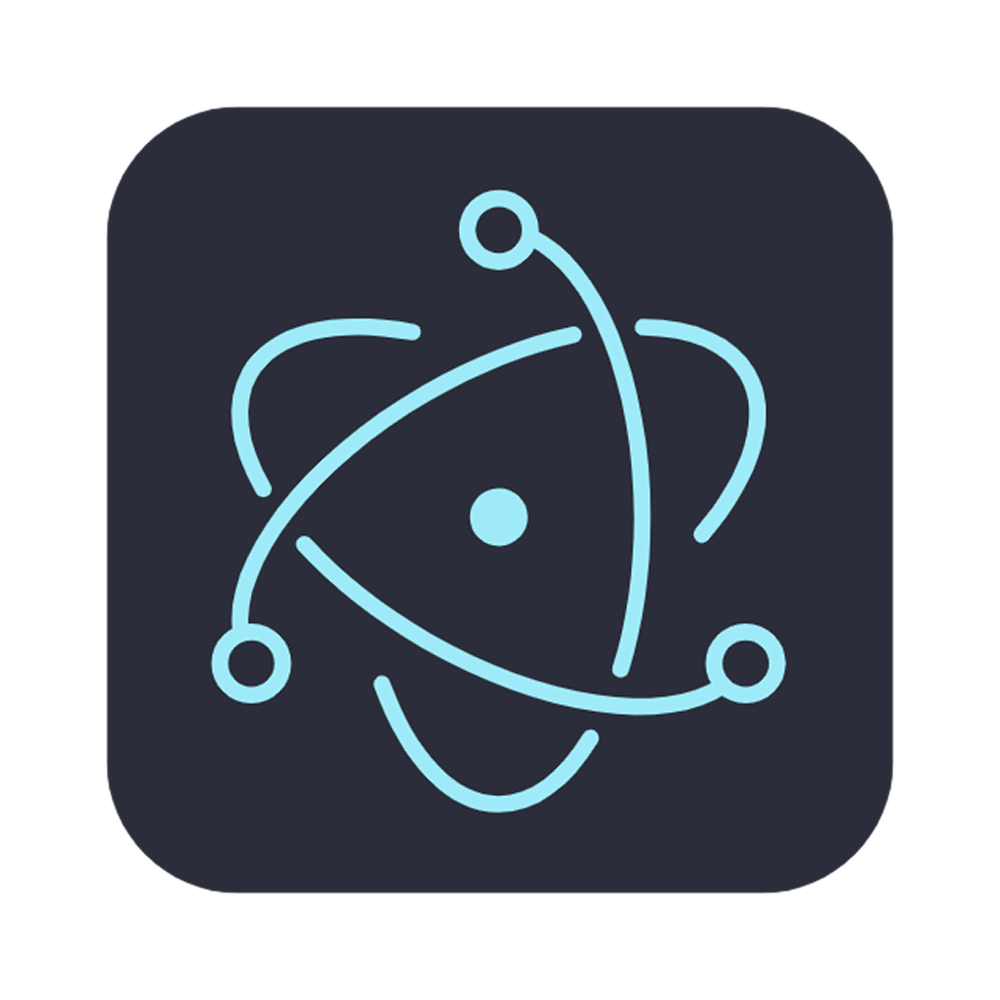

# Monkey AI App

[](https://github.com/horizon0514/monkey-ai-app/actions/workflows/ci.yml)

An Electron application with React and TypeScript

## 下载

- 最新版本: [GitHub Releases - Latest](https://github.com/horizon0514/monkey-ai-app/releases/latest)
- 所有版本: [GitHub Releases](https://github.com/horizon0514/monkey-ai-app/releases)

下载后在 Assets 中选择对应系统的安装包:
- Windows: .exe 或 .msi
- macOS: .dmg 或 .zip
- Linux: .AppImage / .deb / .rpm

## 截图




## Recommended IDE Setup

- [VSCode](https://code.visualstudio.com/) + [ESLint](https://marketplace.visualstudio.com/items?itemName=dbaeumer.vscode-eslint) + [Prettier](https://marketplace.visualstudio.com/items?itemName=esbenp.prettier-vscode)

## Project Setup

### Install

```bash
$ yarn
```

### Development

```bash
$ yarn dev
```

### Build

```bash
# For windows
$ yarn build:win

# For macOS
$ yarn build:mac

# For Linux
$ yarn build:linux
```
